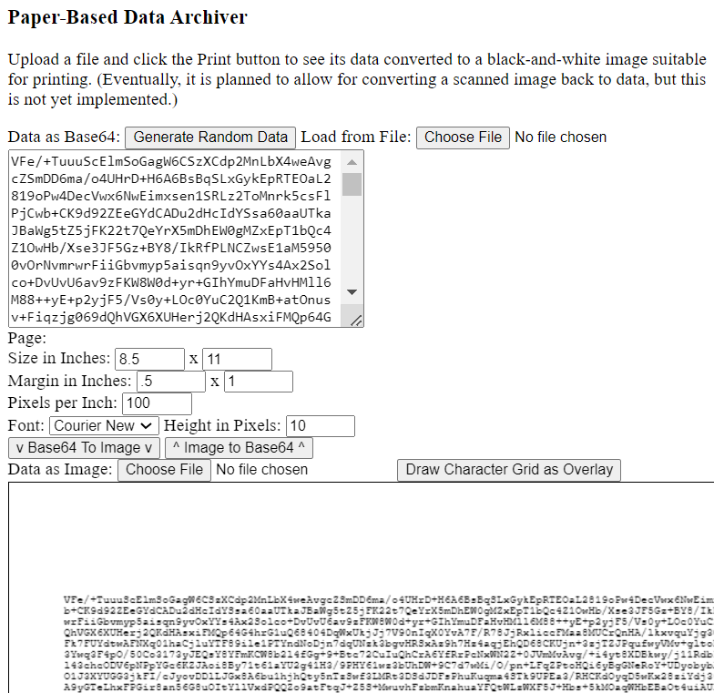

Paper-Based Data Archiver
=========================

Converts a data file's bytes into a black-and-white image of Base64 chars 
suitable for printing.  It is eventually planned for a scanned image of
this printout can be converted back to the original data, but this
is not yet implemented.

